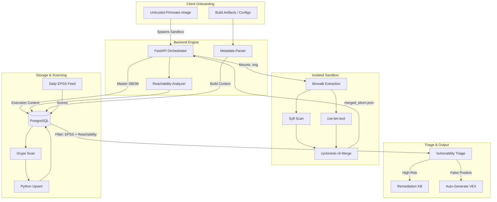

# RIOT Platform: Technical Architecture & Pipeline Documentation

**Purpose:** This document defines the complete technical stack, data pipeline, and database 
schema for the RIOT embedded security platform[cite: 1]. It serves as the authoritative 
blueprint for ingestion, analysis, continuous monitoring, and ecosystem-agnostic remediation 
across Yocto, Buildroot, custom Linux distros, and RTOS environments[cite: 1], with a core 
focus on **vulnerability triage, reachability analysis, and VEX generation**.

---

## 1. System Architecture



## 2. Multi-Ecosystem Ingestion Strategy

The platform does not assume a specific build system. Ingestion adapts based on the client's architecture:

### 2.1. Standard Linux Rootfs (Yocto, Buildroot, Hand-Rolled)

*   **Artifacts:** Compiled firmware image (`.img`) and optional metadata.
*   **Process:**
    1. The backend orchestrator receives the untrusted `.img` and provisions an ephemeral, network-isolated Docker container.
    2. Inside the container, `Binwalk` extracts the rootfs.
    3. `Syft` and `cve-bin-tool` scan the binaries.
    4. `cyclonedx-cli` merges the outputs into a master CycloneDX SBOM.
    5. The master SBOM is returned to the backend, and the container is immediately destroyed to prevent lateral movement or malware persistence.
    6. The backend runs the Reachability Analyzer and Metadata Parser on the safe JSON output.

### 2.2. RTOS & Bare-Metal Binaries (FreeRTOS, Zephyr, Custom Blobs)

* **Artifacts:** Raw binary blobs lacking a traditional Linux filesystem.


* **Process:** Bypasses traditional `Binwalk` rootfs extraction. Relies on signature-based binary matching and direct library fingerprinting via Syft/Grype to flag vulnerable third-party IP stacks (e.g., network stacks, crypto libraries).


### 2.3. CI/CD Native Ingestion (SPDX / BOM Webhooks)

* **Process:** Modern client pipelines POST standard SPDX JSON files directly to the ingestion API, bypassing local extraction entirely.


---

## 3. Database Schema (PostgreSQL)

The database accommodates ecosystem-agnostic component tracking and flexible remediation formats (patches, config changes, or source diffs), and integrates advanced triage metrics (EPSS and VEX).

```sql
CREATE EXTENSION IF NOT EXISTS "uuid-ossp";

-- 3.1. Client & Image Storage
CREATE TABLE clients (
    id UUID PRIMARY KEY DEFAULT uuid_generate_v4(),
    company_name VARCHAR(255) NOT NULL,
    api_key VARCHAR(64) UNIQUE,
    onboarded_at TIMESTAMP DEFAULT CURRENT_TIMESTAMP
);

CREATE TABLE firmware_images (
    id UUID PRIMARY KEY DEFAULT uuid_generate_v4(),
    client_id UUID REFERENCES clients(id) ON DELETE CASCADE,
    image_name VARCHAR(255) NOT NULL,
    version VARCHAR(100),
    build_system VARCHAR(50), -- e.g., 'yocto', 'buildroot', 'custom_linux', 'rtos'
    raw_sbom JSONB, 
    analyzed_at TIMESTAMP DEFAULT CURRENT_TIMESTAMP
);

-- 3.2. Ecosystem-Agnostic Component Tracking
CREATE TABLE components (
    id UUID PRIMARY KEY DEFAULT uuid_generate_v4(),
    image_id UUID REFERENCES firmware_images(id) ON DELETE CASCADE,
    package_name VARCHAR(255) NOT NULL, 
    version VARCHAR(100) NOT NULL,
    purl VARCHAR(255), 
    origin_context VARCHAR(255), 
    recipe_or_module VARCHAR(255), 
    source_repo VARCHAR(255)   
);
CREATE INDEX idx_components_name_version ON components(package_name, version);

-- 3.3. Vulnerability Mapping & Triage Intelligence
CREATE TABLE vulnerabilities (
    cve_id VARCHAR(50) PRIMARY KEY,
    severity VARCHAR(50),
    cvss_score NUMERIC(3,1),
    epss_score NUMERIC(4,3), -- Exploit Prediction Scoring System (0.000 to 1.000)
    description TEXT,
    discovered_at TIMESTAMP DEFAULT CURRENT_TIMESTAMP
);

CREATE TABLE component_vulnerabilities (
    component_id UUID REFERENCES components(id) ON DELETE CASCADE,
    cve_id VARCHAR(50) REFERENCES vulnerabilities(cve_id) ON DELETE CASCADE,
    status VARCHAR(50) DEFAULT 'open', 
    vex_status VARCHAR(50) DEFAULT 'under_investigation', -- 'affected', 'not_affected', 'fixed'
    vex_justification VARCHAR(100), -- e.g., 'vulnerable_code_not_in_execute_path'
    is_network_exposed BOOLEAN DEFAULT FALSE,
    PRIMARY KEY (component_id, cve_id)
);

-- 3.4. The Remediation Knowledge Base (Flexible Output)
CREATE TABLE remediations (
    id UUID PRIMARY KEY DEFAULT uuid_generate_v4(),
    cve_id VARCHAR(50) REFERENCES vulnerabilities(cve_id),
    package_name VARCHAR(255) NOT NULL,
    build_system_context VARCHAR(50), 
    remediation_steps JSONB NOT NULL, 
    patch_file BYTEA, 
    created_at TIMESTAMP DEFAULT CURRENT_TIMESTAMP,
    updated_at TIMESTAMP DEFAULT CURRENT_TIMESTAMP,
    UNIQUE (cve_id, package_name, build_system_context)
);

```

---

## 4. The 3-Layer Triage & Reachability Pipeline

To solve the "scanner noise" problem (delivering 500+ uncontextualized alerts), RIOT employs a 3-layer filter:

1. **Layer 1: EPSS Overlay:** The daily cron job fetches the global EPSS feed. Vulnerabilities with high CVSS but near-zero EPSS scores are deprioritized.
2. **Layer 2: Network & Execution Context:** During Binwalk extraction, the platform maps `systemd` services and `init.d` scripts to identify which binaries are actually executed and listening on network ports, flagging `is_network_exposed = TRUE`.
3. **Layer 3: VEX Automation:** For vulnerabilities located in dead code or unexposed libraries, the backend automatically sets `vex_status = 'not_affected'` and generates a standard VEX (Vulnerability Exploitability eXchange) JSON document for the client to hand to EU CRA auditors.

---

## 5. Continuous Vulnerability Monitoring Pipeline

Vulnerability tracking relies on a daily automated batch process, decoupling SBOM generation from CVE scanning.

### Execution Flow

1. **Trigger:** `cron` executes `cve_monitor.py` daily at 02:00 UTC.


2. **Update Database:** Subprocess runs `grype db update`.


3. **Data Retrieval:** Script queries `SELECT id, raw_sbom FROM firmware_images`.


4. **Stdin Processing:** Feeds `JSONB` data into Grype via `stdin` (`grype sbom:- -o json`).


5. **Upsert Logic:** New CVEs are inserted into `vulnerabilities` (`ON CONFLICT DO NOTHING`), and relationships are mapped into `component_vulnerabilities`.


6. **Trigger Alert:** Fires if a net-new CVE-to-Component mapping is detected.


---

## 6. Alerting & Remediation Workflow

When a new vulnerability triggers an alert, the system executes the resolution path:

### Step 1: Internal Triage & KB Lookup

The backend queries the `remediations` table for matching vulnerabilities and build contexts.

* **Cache Hit:** Automatically drafts a client notification containing the stored patch or configuration fix.


* **Cache Miss:** An internal Slack/Email webhook alerts the engineering team with the affected package, version, and `origin_context`.


### Step 2: Engineering Patch Generation

1. Engineering formulates the fix based on the target environment (e.g., a Yocto `.bbappend` patch, a Buildroot package version bump, or a custom Makefile update).


2. The patch/diff and instructions are uploaded to the `remediations` table.


3. The `status` in `component_vulnerabilities` is updated to `patched`.


### Step 3: Client Notification

The client receives a precise technical brief containing the CVE details, affected image layer/module, and the exact remediation artifacts.

---

## 7. Technical Roadmap & Next Steps

* **7.1. CI/CD REST API Pipeline:** Deploy `POST /api/v1/sbom/upload` to ingest native SPDX and CycloneDX files automatically from client build servers.


* **7.2. Multi-Format Manifest Parsers:** Build extensible Python parsers to automatically ingest Buildroot `.config` files and Yocto manifests to populate `origin_context` without manual entry.


* **7.3. Automated Remediation Dispatch:** Automate cache-hit notifications so that known CVE fixes are emailed instantly to clients with zero human intervention.


* **7.4. EPSS Integration Script:** Fetch CSV/JSON from FIRST.org daily to update the `epss_score` column.
* **7.5. VEX Generator API:** Endpoint to export `component_vulnerabilities` where `vex_status` != 'affected' into a compliant CSAF/VEX JSON format.

